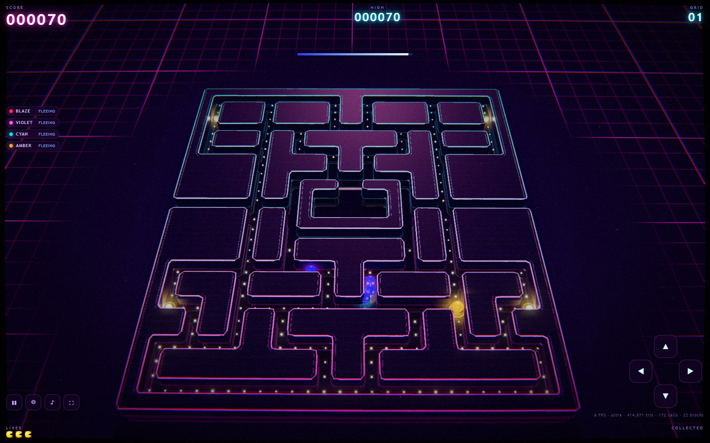

# NEON GRID — a synthwave 3D maze chase

A from-scratch 3D take on the 1980 arcade maze-chase, built with Three.js and rendered as
a neon monolith sitting on an infinite magenta grid under a banded sunset. Runs in any
modern browser, desktop or phone, with no install and no build step for the player.

**▶ Play: https://javieranta.github.io/neon-grid-3d/**


---

## What it is

The full arcade rule set, reimplemented as pure logic, wrapped in a synthwave renderer:

| | |
|---|---|
| **Maze** | Faithful 28 × 31 reconstruction — 240 pellets, 4 energizers, wrap-around side tunnel, sealed ghost house |
| **Ghosts** | All four original personalities with their real target-tile AI, including the Pinky/Inky "facing up" overflow quirk |
| **Modes** | Scatter/chase wave schedules per level, forced reversals on every flip, the four no-up junctions, Cruise Elroy |
| **Power pellets** | Per-level fright durations, ghost chain 200 → 400 → 800 → 1600, end-of-fright flashing |
| **Ghost house** | Personal dot counters, the global counter that takes over after a death, and the release timeout |
| **Speeds** | Arcade percentages of 75.76 px/s, including tunnel slowdown and frightened speeds |
| **Fruit** | All eight, appearing at 70 and 170 dots, worth 100 → 5000 |
| **Lives** | Three, extra life at 10,000, per-level progression to 21+ |

Nothing is loaded from disk: every mesh, texture, sound and note is generated at runtime.

## The look

There is no ray tracing in a browser, so the "raytraced neon" read is earned with raster
tricks stacked deliberately:

- **Wall silhouettes, not cubes.** Each connected wall region's true outline is extracted
  by marching-edge boundary tracing, corner-rounded, and extruded into a bevelled slab.
  Every kerb then carries **three** swept neon tubes — cyan on the silhouette, magenta on
  an inset partner line, and a magenta rule at waist height — plus vertical strips down
  the faces, so the neon has real thickness and reads from any angle.
- **The maze lights itself.** A cube render from the middle of the board is PMREM-filtered
  into the scene environment, so every glossy surface reflects the maze's own neon. That is
  what produces the wet-black look; with only the sky to reflect, the walls read matte. The
  sun is masked during the bake — it is orders of magnitude brighter than the neon and would
  dominate every reflection.
- **Low kerbs.** Walls are well under a tile tall. At the game's camera angle a tile-tall
  wall occludes more than a tile of floor behind it, which made whole runs of pellets look
  unreachable even though they never were. In first person the same geometry stretches into
  full-height corridors, with the tubes translated rather than scaled so their cross-sections
  stay round.
- **Baked light spill.** The same silhouettes are stroked into a blurred canvas and used
  as the floor's emissive, so the neon appears to bleed onto the ground — a cheap, stable
  stand-in for global illumination.
- **Real planar reflections** by mirroring the world under a semi-transparent floor, so
  Pac-Man, the ghosts and the whole maze reflect in the polished surface.
- **Post chain:** HDR bloom → ACES tone map → a single grade pass doing barrel distortion,
  radial chromatic aberration, CRT scanlines, aperture grille, film grain, vignette, a
  purple-lift/cyan-highlight curve, and the tear-glitch that fires on death.
- **Environment:** shader sky with a banded sun, star field, a distance-LOD infinite grid,
  layered mountain ridges with neon rims, drifting motes and slow volumetric shafts.

Four cameras, each with its own field of view: a framed **overview** that fits the whole
maze at any aspect ratio and sits below half the FOV so the sunset stays in shot, a
three-quarter **chase** cam, a **first-person** view inside the corridors — the mode the
planned VR port will use — and a **cinematic** sweep composed for the sunset.

Depth of field is deliberately absent. It suits a still, but a headset renders per eye and
the viewer's own eyes accommodate, so baked DoF in VR reads as blur.




## Audio

Entirely synthesised with the Web Audio API — no samples. A small FX bank (waka, power
surge, ghost chain, death glissando), a pitch-shifting ghost siren that tightens as the
maze empties, and an **original** synthwave backing track: filtered saw bass, a plucked
sixteenth arp, detuned pads and drums, sequenced by a look-ahead scheduler over an
A-minor progression. Intensity rises with the level.

## Playing

| Action | Desktop | Touch |
|---|---|---|
| Move | WASD / arrows | swipe anywhere, or the thumb pad |
| Camera cycle | C | ◎ button (overview → chase → first person → cinematic) |
| Start / resume | Enter or Space | tap |
| Pause | P or Esc | ❚❚ button |
| Sound | M | ♪ button |
| Fullscreen | F | ⛶ button |

On iPhone, add it to your home screen for a fullscreen, chrome-free run.

`?tier=ultra|high|medium|low|potato` pins the quality tier and disables the adaptive
watchdog — useful for capture or for forcing maximum fidelity on a strong GPU.

## Performance

One scene, five quality tiers, chosen from the device profile at boot and then walked down
automatically by a frame-time watchdog if a device misses budget. The tiers trade MSAA,
shadows, reflections, mote count, light count, bloom, tube tessellation and pixel ratio;
the neon look survives all the way down.

Typical desktop GPU: ~640k triangles, ~275 draw calls at the ultra tier.

## Developing

```bash
npm install
npm run dev            # vite dev server
npm run build          # static build into docs/ (what GitHub Pages serves)
npm test               # 158 assertions: simulation + geometry/grid agreement
npm run test:e2e       # 32 browser assertions, desktop + iPhone viewports
npm run gallery        # renders the still gallery under media/
```

The test suites are the interesting part:

- **`tests/logic.test.mjs`** drives the pure simulation for 25 simulated minutes with a
  pellet-seeking bot and asserts the invariants a maze chase must never break — nobody
  ever enters a wall, every tile stays reachable, the ghost chain doubles correctly, the
  ghost AI targets the exact arcade tiles, eaten ghosts find their way home.
- **`tests/e2e.mjs`** serves the production build to headless Chromium, decodes the
  screenshots in-process, and asserts on *pixels*: that magenta and cyan neon are actually
  present, that the whole maze fits a portrait iPhone viewport, that the touch pad works,
  that no JavaScript errors occur across a soak.
- **`tests/geometry.test.mjs`** checks that the traced wall silhouettes agree with the
  logical grid — that no collectible sits inside a wall, none is stranded in an isolated
  pocket, and every one keeps visual clearance from the neon. Written after a report that
  some pellets looked unreachable: they never were, but tall walls were hiding them.
- **`tests/maze-preview.mjs`** renders the maze grid in the original's own 8-pixel style so
  the layout can be compared against a reference screenshot tile by tile.

## Layout

```
src/
  core/      pure simulation — no Three.js, no DOM, fully unit-testable
    maze.js levels.js actor.js ghost.js game.js
  render/    everything visual
    renderer.js mazeMesh.js actors.js environment.js postfx.js quality.js palette.js
  audio/synth.js
  ui/        hud.js input.js style.css
  main.js    fixed-timestep loop wiring the three layers together
```

The simulation never imports the renderer and never touches the DOM, which is why it can
be driven headlessly at thousands of frames per second in the test suite.

## Notes on originality

This is an original implementation: the maze topology and rule set of a 1980 arcade game
are reproduced from public documentation, but all code, geometry, colour design, audio and
naming are new. The ghosts are named Blaze, Violet, Cyan and Amber. Built as an AI
benchmark artefact, not for release.

## Licence

MIT — see [LICENSE](LICENSE).
